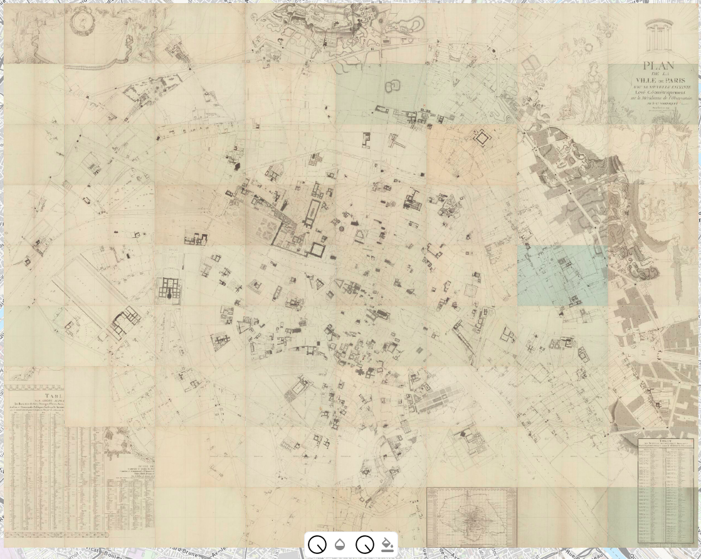
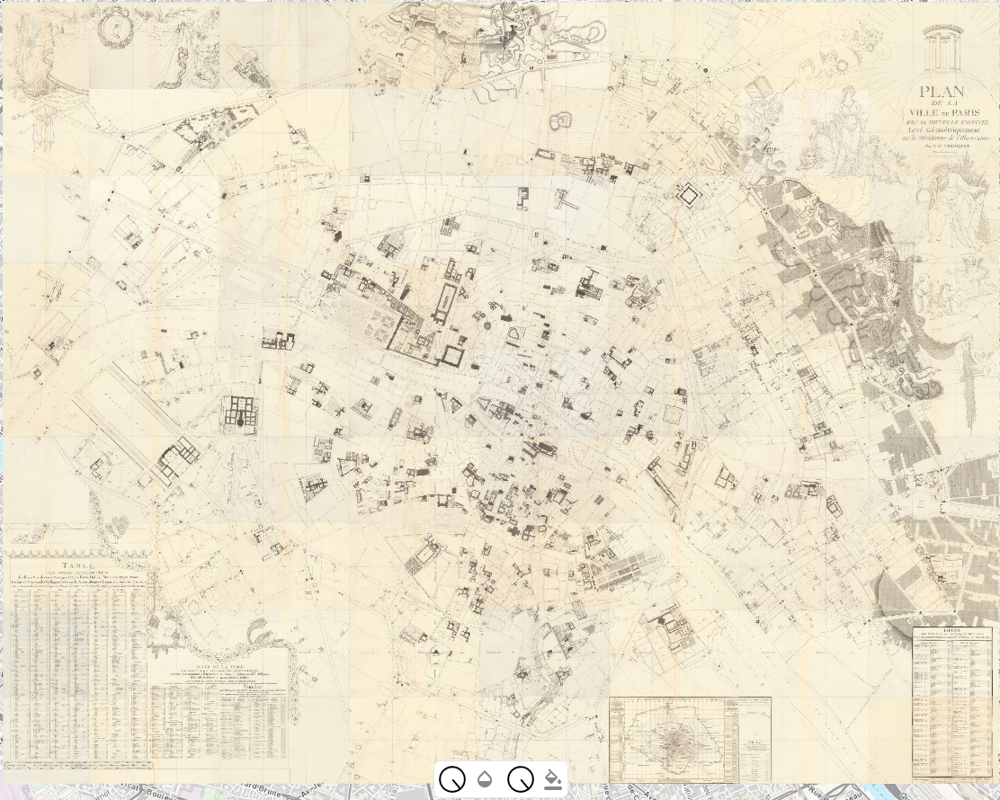
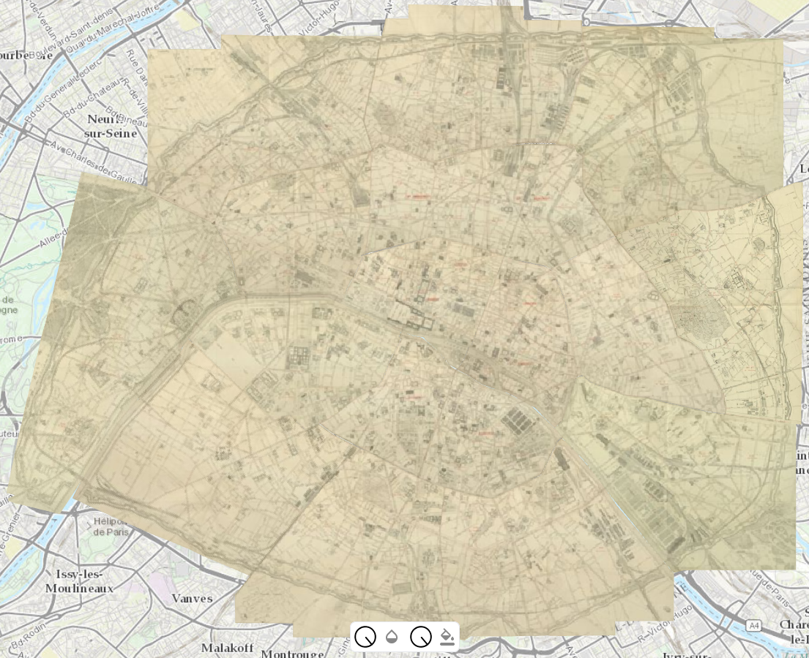
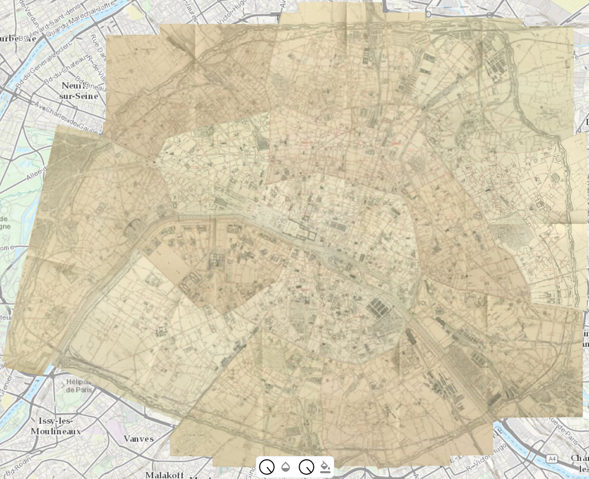
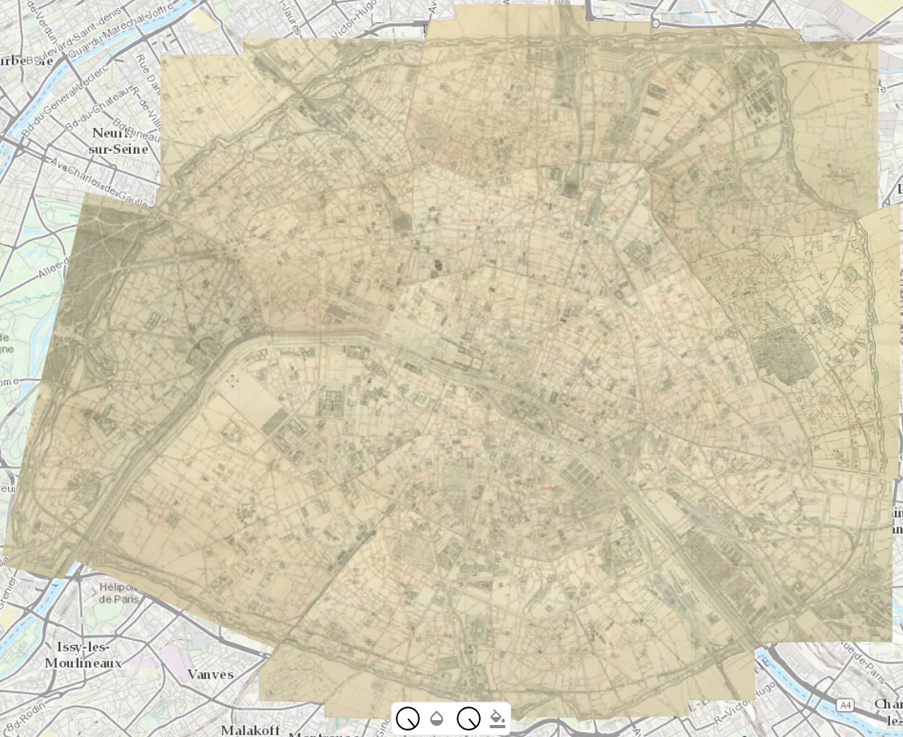

# A few maps of Paris georeferenced with Allmaps annotations

## The Verniquet Atlas from Gallica (BnF) [link](https://gallica.bnf.fr/ark:/12148/btv1b53243704g)

|  |
|:--:|
| <b>[See it on the Allmaps viewer](https://viewer.allmaps.org/?url=https%3A%2F%2Fdataverse.harvard.edu%2Fapi%2Faccess%2Fdatafile%2F7002730)</b>|

## The Verniquet Atlas from David Rumsey (Stanford) [link](https://www.davidrumsey.com/luna/servlet/detail/RUMSEY~8~1~305627~90076038)

|  |
|:--:|
| <b>[See it on the Allmaps viewer](https://viewer.allmaps.org/?url=https%3A%2F%2Fdataverse.harvard.edu%2Fapi%2Faccess%2Fdatafile%2F7002615)</b>|

## The Atlas municipal [...] 1887 from BHdV (Ville de Paris) [link](http://bibliotheques-specialisees.paris.fr/ark:/73873/pf0000935115)

|  |
|:--:|
| <b>[See it on the Allmaps viewer](https://viewer.allmaps.org/?url=https%3A%2F%2Fraw.githubusercontent.com%2Fsoduco%2Fallmaps_annotations%2Fmain%2Foutput%2Fbhdv_atlas_municipal_1887%2Fannotation_bhdv_atlas_municipal_1887.json)</b>|

## The Atlas municipal [...] 1888 from BHdV (Ville de Paris) [link](https://bibliotheques-specialisees.paris.fr/ark:/73873/pf0000935116)

|  |
|:--:|
| <b>[See it on the Allmaps viewer](https://viewer.allmaps.org/?url=https%3A%2F%2Fraw.githubusercontent.com%2Fsoduco%2Fallmaps_annotations%2Fmain%2Foutput%2Fbhdv_atlas_municipal_1888%2Fannotation_bhdv_atlas_municipal_1888.json)</b>|

## The Atlas municipal [...] 1900 from BHdV (Ville de Paris) [link](https://bibliotheques-specialisees.paris.fr/ark:/73873/pf0000935510)

|  |
|:--:|
| <b>[See it on the Allmaps viewer](https://viewer.allmaps.org/?url=https%3A%2F%2Fraw.githubusercontent.com%2Fsoduco%2Fallmaps_annotations%2Fmain%2Foutput%2Fbhdv_atlas_municipal_1900%2Fannotation_bhdv_atlas_municipal_1900.json)</b>|

# A repository to convert QGIS GCPs to Allmaps annotations
[For more information, please go look at the GitHub repository!](https://github.com/soduco/allmaps_annotations)
