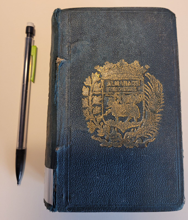
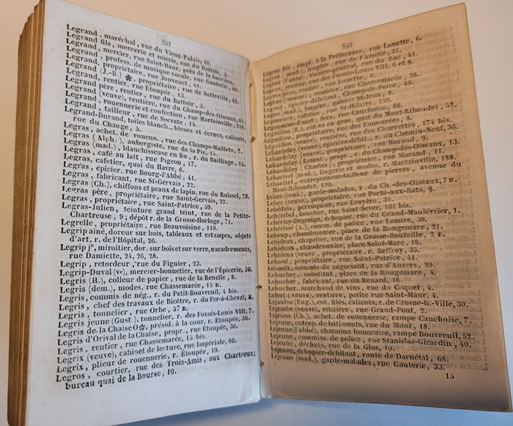
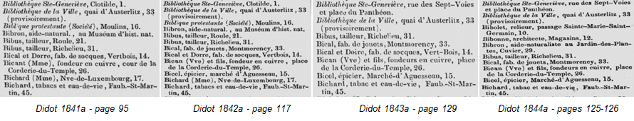

## SODUCO main goals

The SoDUCo project develops approaches, models and tools to study the evolution of the urban spatial structure in relation with social and professional practices of the population. We develop our study on the reconstitution of the evolution of Paris from 1789 to 1950 using two specific sets of sources: 
- 16 master maps and the complete series of cadastral maps of Paris and its suburbs, which describe the evolution of road networks and urban fabric, 
- trade directories, which provide the professional activities and/or the social status of people localized by their individual addresses. 

The project team thus develops approaches, models and tools to automatically extract the useful information from both sources, and to collaboratively check, control and refine every information extracted. It aims at building, analysing and publishing an important open database on the social and urban history of Paris.

The project is committed to an open science approach: all publications, data, models and tools developed will be published under an open licence to foster their reuse in other contexts on different time periods, other cities and other scales.

## Historical sources to retrace the evolution of Paris from 1789 to 1950

### Master maps and cadastral maps

### Trade directories

An inventory of directories offering lists of Parisian addresses between 1797 and 1914, organised into series and collections has been carried out by the project: see Fig. 1 and Fig. 2 for an example of directory used in the project. Of the directories listed, 113 were available in digital format and can be used in the project. 

|  |  |
|:--:|:--:|
| <b>Fig. 1: An example of a trade directory from the 19th century used in the SODUCO Project</b>|<b>Fig. 1: The content of the directory shown in Fig. 1</b>|

The dates of publication of these directories are spread throughout the period from 1797 to 1914 so that they offer an almost continuous view of the activities of Parisians over this period, as shown in Fig. 3.

|  | 
|:--:|
| <b>Fig. 3: An example of successive Didot directories with entries evolving through time</b>||

