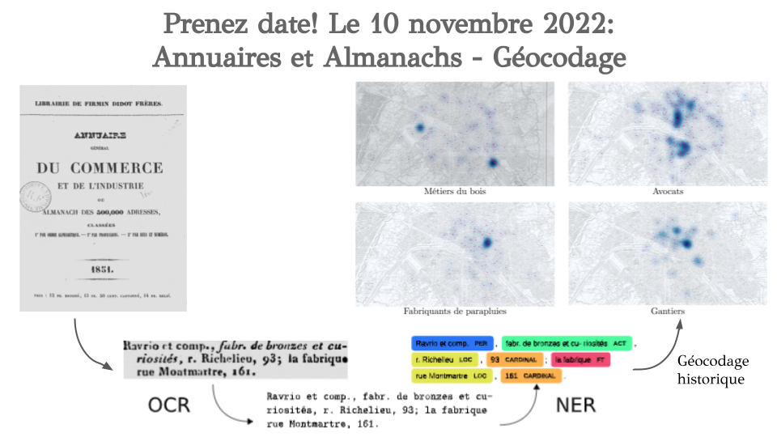

The SODUCO project and the Franch National Library (Biblothèque nationale de France) are organising a series of seminars around the historical sources used by the project and the approaches developed to process them. 

Invited talks are included to give a more comprehensive overview of the state of the art of current projects and existing works in the field of digital humanities, dealing with the same issues. 

During the SODUCO/BnF seminars, the presentations and discussions are mainly in French. That is why the programmes below are presented in French.

## Séance 1/4: Paris, capitale géodésique. Atlas et plans à grande échelle: 1780 - 1950

**Date:** Lundi 11 avril 2022.

**Lieu:** BnF, Paris, Belvédère du site François-Mitterrand (18e étage tour T2).

### Résumé

L'acquisition (et l'accumulation) de données numériques provenant des sources cartographiques anciennes est au coeur de nombreux travaux de recherche contemporains parmi lesquels notre séminaire entend se situer et prendre place comme un lieu ouvert de rencontre, de discussions et de collaborations entre chercheurs et professionnels en charge des divers dépôts et collections de sources. Pour cette première séance, nous nous proposons de présenter quelques contours de notre terrain d'enquête privilégié - la cartographie de Paris à l'époque moderne et contemporaine, ainsi que les voies et moyens par lesquels nous comptons l'arpenter.

### Programme 

** Matinée :** Présidence, Cristina Ion (BnF).

9h30. Le dossier Verniquet. Introduction à l'édition critique / numérique de l'Atlas du plan général de la ville de Paris (1795).
Ange Aniesa (BnF) et Stéphane Baciocchi (EHESS) coord.

10h30. Le système de référence de coordonnées de Paris, levé géométriquement par le citoyen Verniquet.
Bertrand Duménieu (EHESS) coord., Nathalie Abadie (LASTIG, univ. Gustave Eiffel, IGN-ENSG), Yann Ménéroux (LASTIG, univ. Gustave Eiffel, IGN-ENSG).

11h30-12h00. Discussion

** Après-midi: ** Présidence, Nathalie Abadie (LASTIG, univ. Gustave Eiffel, IGN-ENSG).

14h00. Exercices sur l'extraction automatique de données géométriques.
J. Chazalon (EPITA) et J. Perret (IGN) coord.

- Yizi Chen (LASTIG, univ. Gustave Eiffel, IGN-ENSG): "Facilitating the vectorization of historical maps: a study"

- Rémi Petitpierre (EPFL): "Recartographier le passé: une infrastructure pour la Time Machine"

16h00. Discussion générale

17h00. Clôture.

## Séance 2/4: Annuaires et Almanachs - Géocodage

**Date:** Jeudi 10 novembre 2022.

**Lieu:** BnF, Paris, site François-Mitterrand (Petit auditorium, salle 70).

### Résumé

|  |
|:--:|
| <b>Le deuxième séminaire SODUCO/BnF sera dédié aux annuaires et à leur traitement</b>|

### Programme

TBA!
