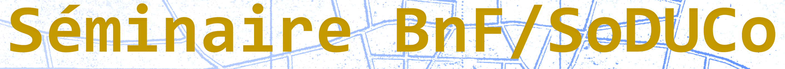
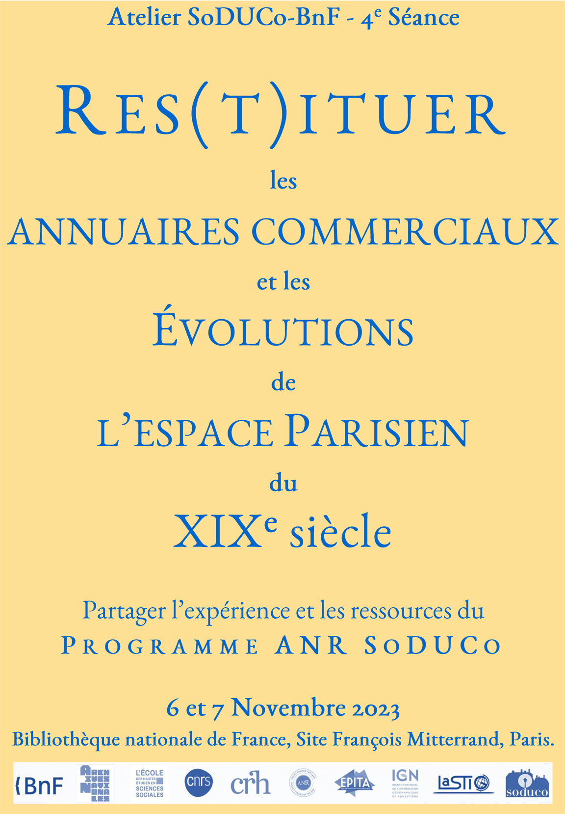
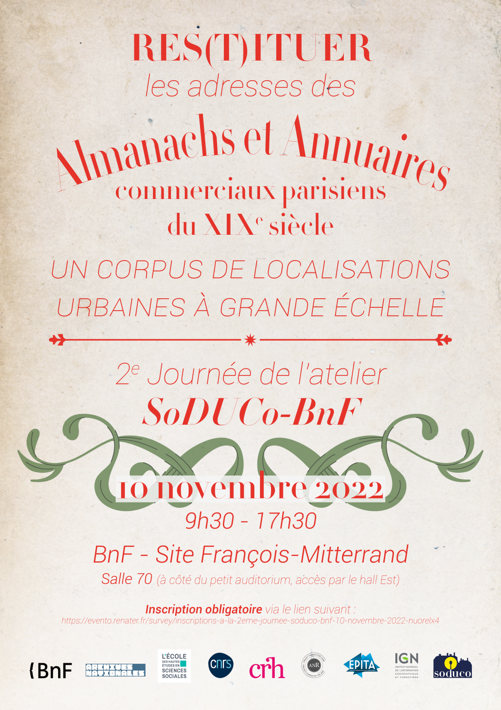
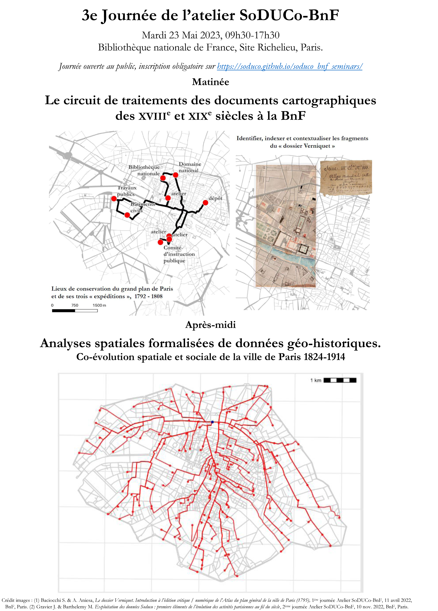

<!---

<h3 style="text-align:center; font-weight:bold;">INSCRIPTION à la troisième séance, mardi 23 mai 2023</h3>
La journée est ouverte au public. L'inscription est obligatoire via le lien suivant <a href="https://evento.renater.fr/survey/inscriptions-a-la-3eme-journee-soduco-bnf-23-mai-2023-m3qnah52">https://evento.renater.fr/survey/inscriptions-a-la-3eme-journee-soduco-bnf-23-mai-2023-m3qnah52</a>
 
Lieu: BnF, Paris, site Richelieu (salle des conférences), 5 Rue Vivienne 75002 Paris. 9h30-17h30.
 
<a href="#séance-34-le-circuit-de-traitements-des-documents-cartographiques-des-xviiie-et-xixe-siècles-à-la-bnf---analyses-spatiales-formalisées-de-données-géo-historiques"> Cf. informations sur le programme de la journée.</a>

-->

The SODUCO project and the French National Library (Biblothèque nationale de France) are organising a joint seminar, the SoDUCo-BnF seminar, around the historical sources used by the project and the approaches developed to process them. It aims at diffusing and questioning the research done within the project, and at animating dialogues between researchers and professionals in document conservation on common objects and projects ranging from the exploitation of documents (maps, commerce directories) to the production and diffusion of open data (historical geocoding, spatial analysis, open science).

Invited talks are included to give a more comprehensive overview of the state of the art of current projects and existing works in the field of digital humanities, dealing with the same issues. 
During the SODUCO/BnF seminars, the presentations and discussions are mainly in French. That is why the programmes below are presented in French.

***

En 2022-2023, l’équipe SoDUCo et la BnF organisent un séminaire commun, **l’atelier SoDUCo-BnF**. Il a pour perspective de diffuser et mettre en question le travail réalisé dans le cadre de SoDUCo et de faire dialoguer chercheurs et spécialistes de la conservation des documents sur des objets et projets communs allant de l’exploitation des fonds (cartes et plans, annuaires du commerce) à la production et diffusion de données libres (géocodage historique, analyse spatiale, science ouverte).

**Equipe organisatrice** : *A. Aniesa, P. Chevallier, C. Ion, E. Netchine (BnF), N. Abadie, J. Perret, J. Raimbault, S. Tual (IGN), E. Carlinet, J. Chazalon (EPITA), S. Baciocchi, M. Barthelemy, P. Cristofoli, B. Dumenieu, J. Gravier (EHESS) avec la collaboration de J. Garel-Grislin, O. Loiseaux, J.-D. Mellot et J.-P. Moreux (BNF), V. Rebolledo-Dhuin (UPEC), M. Puren (EPITA), P.-A. Le Ny (LeNy Conseil), H. Cheize et M. Fernandez (EHESS), C. Bernard et M. Hersent (IGN).*

***

## Séance 1/4: Paris, capitale géodésique. Atlas et plans à grande échelle: 1780 - 1950
 Voir [ci-dessous](#seance1).
 
*** 
## Séance 2/4: Res(t)ituer les adresses des almanachs et annuaires commerciaux parisiens du XIXe siècle. Un corpus de localisations urbaines à grande échelle
 Voir [ci-dessous](#seance2).
 
*** 
## Séance 3/4: Le circuit de traitements des documents cartographiques des XVIIIe et XIXe siècles à la BnF - Analyses spatiales formalisées de données géo-historiques
 Voir [ci-dessous](#seance3).

***
## Séance 4/4: Res(t)ituer les annuaires commerciaux et les évolutions de l’espace Parisien du XIXe siècle - Partager l’expérience et les ressources du programme ANR SoDUCo
{: #seance4 }

**Séminaire de clôture du programme ANR SoDUCo**

**Date: Lundi 6 (9h30-17h30) et Mardi 7 (9h30-12h30) Novembre 2023.**.

**Lieu:** BnF, Paris, [Site François Mitterrand](https://www.bnf.fr/fr/francois-mitterrand) (salle 70), Quai François Mauriac, 75706 Paris.

Cette 4ème séance de l'Atelier est ouverte au public.

**Inscription obligatoire** aux trois demi-journées via le lien Evento suivant :

[https://evento.renater.fr/survey/inscriptions-a-la-4eme-seance-soduco-bnf-6-et-7-novembre-2023-0j6blqtl](https://evento.renater.fr/survey/inscriptions-a-la-4eme-seance-soduco-bnf-6-et-7-novembre-2023-0j6blqtl))

[Affiche et programme de la 4ème séance SoDUCo-BnF](https://soduco.github.io/public/images/Atelier_Soduco_Bnf_Programme_seance4_6-7Nov2023.pdf) / [Affiche en haute résolution](https://soduco.github.io/public/images/Atelier_Soduco_Bnf_Programme_seance4_6-7Nov2023_HR.png)

### Introduction à la 4ème séance de l'Atelier SoDUCo-BnF:

La 4ème séance de l’Atelier SoDUCo-BnF propose de poursuivre les discussions engagées entre chercheurs et spécialistes de la conservation patrimoniale des documents. Pour rappel, les 3 précédentes séances concernaient : les procédures de conservation, de signalement et de diffusion des documents cartographiques (_Le circuit de traitements des documents cartographiques des XVIIIe et XIXe siècles à la BnF_, 23 mai 2023), les moyens de reconstituer l’histoire des atlas et plans de la ville et d’en proposer une édition critique numérique (_Paris, capitale géodésique. Atlas et plans à grande échelle: 1780–1950_, 10 avril 2022), la définition et l’exploitation du corpus des listes d’adresses des Annuaires commerciaux du XIXe siècle (_Res(t)ituer les adresses des almanachs et annuaires commerciaux parisiens du XIXe siècle. Un corpus de localisations urbaines à grande échelle_, 10 novembre 2022), et enfin un aperçu des analyses qui peuvent être mises en œuvre sur les données qui en sont extraites (_Analyses spatiales formalisées de données géo-historiques_, 23 mai 2023).
Cette dernière séance de l’Atelier est organisée sur deux jours, les 6 et 7 novembre 2023. Elle fait office de séminaire de clôture du programme de recherche SoDUCo (_Dynamiques Sociales en contexte urbain: outils, modèles et données libres – Paris et ses banlieues, 1789-1950_). Elle s’attache à présenter un bref bilan de l'ensemble des réalisations, ainsi que les outils et données mis à la disposition du public.
Lors de son montage, nous avions souhaité inscrire le projet SoDUCo dans une démarche de _Science ouverte_. Nous souhaitons discuter des implications de cette décision sur la nature, l’organisation et les choix techniques du projet. Une telle démarche est encore inégalement partagée et pratiquée dans la communauté scientifique et les travaux et ressources qui en relèvent prennent des formes très diverses, notamment dans le domaine des SHS. Appuyée sur le développement des technologies numériques et les collaborations interdisciplinaires, elle est désormais fortement encouragée et encadrée par les institutions et tutelles de la recherche notamment via la mise en place d’un écosystème sociotechnique dédié (infrastructures et outils, principes et méthodologies, spécialisations professionnelles, …).
Il s’agit dans un premier temps de situer les réalisations du programme de recherche SoDUCo dans ce contexte. Le parti pris assumé de la reproductibilité, de l’ouverture des données et des outils a orienté la manière d’aborder l’_étude de la co-évolution sociale et spatiale de Paris au XIXe_. Il a aussi présidé à de nombreux choix tant techniques que méthodologiques. L’ensemble de ces principes et contraintes a sans aucun doute contribué à façonner procédures, résultats et productions. Il nous semble utile de faire le point sur ces aspects et de confronter l’expérience et les questionnements du consortium SoDUCo avec celles des acteurs et experts de différentes communautés et institutions intéressées par ces questions (_conservation patrimoniale, ingénierie des connaissances, analyse des documents, humanités numériques, recherche en sciences sociales, science participative_).
Peut-on mesurer les effets d’une telle démarche sur nos objets et problématiques de recherche ? Quel est le statut des données numériques produites de manière automatique ? Comment et à quelles conditions est-il possible de les utiliser ? Comment les évaluer et améliorer les procédures de traitement ? Comment ré-utiliser les outils dans d’autres contextes et avec d’autres sources ? Peut-on parvenir à cumuler résultats et travaux issus de l’exploitation des corpus du projet ? Comment mettre à jour, enrichir ou encore pérenniser de telles objets et outils numériques ? Comment interagir avec l'écosystème actuel de la conservation patrimoniale et de la recherche et anticiper ses évolutions ?

### Programme prévisionnel de la Matinée du Lundi 6 Novembre (9h30-12h00) 

09h00. Accueil du public en salle 70.

09h30. Ouverture de la journée : **SoDUCo team**, _Le programme de recherche SoDUCo. Bilan_

**10h00 - 12h15 Session Métadonnées, catalogage et diffusion de données**

Cette demi-journée revient sur les questions du catalogage, de la diffusion des données et des métadonnées pour les projets de recherche en humanités numériques impliqués dans une démarche de science ouverte. Nous présenterons le géo-catalogue développé dans le cadre de SoDUCo pour élaborer à partir de sources éparses des corpus de documents adaptés aux questions de recherche, puis conserver la trace des divers traitements qui leur sont appliqués ainsi que les états intermédiaires et finaux des données numériques qui en sont extraites. Nous discuterons notamment les notions de collections et de corpus, d’interopérabilité, de pérennité, de même que nous poursuivrons les réflexions engagées lors des précédentes journées sur rapports entre les catalogages patrimoniaux inter-institutionnels et le catalogage orienté vers l’usage de la recherche. Sur quelles bases chercheurs et spécialistes de la documentation peuvent-il collaborer ? Comment pouvons-nous nous organiser pour utiliser les acquis de SoDUCo et de l’atelier SoDUCo-BnF et créer les conditions d’une cumulativité à la fois du point de vue de la recherche et du point de vue des institutions patrimoniales. Quels principes, quels outils et quel modèle de travail pouvons-nous adopter pour aller plus loin ensemble sur d’autres sujets/objets et avec d’autres acteurs/publics.

- 10h00. **SoDUCo team**, _Catalogage et diffusion des données dans le programme SoDUCo_. 
- 10h30. Questions.
- 10h45. **J. Schoonman, B. Spaan & M. Claeys Bouuaert** ([Allmaps](https://allmaps.org/)), Présentation du consortium [Allmaps](https://allmaps.org/).
- 11h05. **M. Denel et al.** (Wikimedia France), _Science participative, science ouverte. L'expérience de Wikimedia France_**
- 11h25. **Adeline Joffres** (Huma-num), Sous réserve.
- 11h45. Questions.
- 12h00. Discussion - Table ronde.

12h00. Pause-déjeuner.

### Programme provisionnel de l'après-Midi du Lundi 6 Novembre (13h30-17h30):

13h45. Accueil du public en salle 70.

**14h00 - 16h30 - Session Extraction et structuration des données**

Cette demi-journée revient sur les questions d’analyse automatique de documents anciens semi-structurés, de la détection de leur mise en page à la structuration spatio-temporelle des informations qu’ils contiennent. Nous y présenterons les travaux réalisés dans le projet SoDUCo sur les annuaires du commerce parisien du XIXe siècle pour permettre le suivi spatio-temporel de chaque commerce recensé dans ces annuaires. Sur la base de ces expériences, il nous semble utile d’élargir les discussions sur deux aspects ouvrant encore de nombreuses perspectives de recherche : l’analyse automatique de documents anciens et la représentation de connaissances géohistoriques.

- 14h00. **SoDUCo team**, _Extraction et structuration de données dans le programme SoDUCo_.
- 14h30. **C. Duvette et P. Kervegan** (Département des études et de la recherche - Institut national d'histoire de l'art, INHA), _Chapeliers, architectes, nouveautés : géo-analyse des activités visibles et invisibles d'un quartier_
- 14h50. Questions.
- 15h05. Pause café.
- 15h20. **N. Hernandez, W. Charles** (_Institut de Recherche en Informatique de Toulouse_ - IRIT, Université de Toulouse Jean Jaurès) et **S. Poublanc** (_France, Amérique, Espagne, Sociétés, Pouvoirs, Acteurs_- Framespa, Université de Toulouse Jean Jaurès, Framespa), _Représenter les territoires de la France moderne dans des graphes de connaissances : le projet OBARDI_.
- 15h40. **C. Kermorvant** ([TEKLIA](https://teklia.com/fr/)), _Nouvelles approches pour l’extraction d’informations dans des documents numérisés_.
- 16h00. Questions.
- 16h15. Discussion - Table ronde.

**16h30. Pause café**

**16h45 - 17h30 - Keynote**

- 16h45. *Keynote*: **M. Barthelemy** (Institut de Physique Théorique, Commissariat à l'Energie Atomique et aux Energies Alternatives) et **J. Gravier** (Centre de recherches historiques - CRH et Centre d'analyse et de mathématique sociales - CAMS, Ecole des hautes études en sciences sociales) :

**17h30. Clôture de la journée.**

### Programme prévisionnel de la Matinée du Mardi 7 Novembre (9h30-12h15) 

09h30. Accueil du public en salle 70.

**10h00 - 12h30 - Session Données historiques numériques - évaluations critiques et perspectives d'utilisations**

La matinée «Données historiques numériques» vise à confronter l’expérience de chercheurs qui construisent et analysent régulièrement des corpus de données numériques élaborés à partir de documents d’archives (texte et cartes). Dans un moment où l’on assiste à l’explosion de la production de données numériques ouvertes issues de sources anciennes, les questions classiques des conditions d’appropriation et de réutilisation de ces nouvelles « sources » par des tiers se posent de manière accrue.
Cette matinée invite plus particulièrement à réfléchir à ces questions dans le cas où les corpus de gros volumes de données numériques sont produits à partir de processus entièrement automatisés d’extraction de documents et d’enrichissement. Partant des travaux réalisés dans le cadre du programme SoDUCo, notamment du corpus des _Annuaires historiques parisiens_ et de la _géolocalisation historique_ des entrées d’annuaires sur les plans anciens, nous souhaitons aborder les questions suivantes au cours de la matinée: Comment et à quelles conditions peut-on s’emparer efficacement de telles « sources numériques » ? Comment les comprendre, évaluer leur « qualité » et leur rapport avec les sources initiales ? Comment comparer ou rendre cumulable les travaux très divers qui peuvent être issus de l’exploitation de ces jeux de données ? Enfin, nous souhaitons discuter collectivement les perspectives d’analyse et d’exploitation du corpus des _Annuaires historiques parisiens_.

- 10h00. **SoDUCo team**, _Les données géohistoriques produites au cours du programme SoDUCo. Evaluation d’une « source numérique »_. 
- 10h30. **L. Kesztenbaum, G. Postel-Vinay (Institut national d'études démographiques, INED)**, _Construction de bases de données historiques: retours d'expérience_.
- 10h50. Questions.
- 11h05. **C. Lemercier (CNRS - Centre de sociologie des organisations - Sciences Po-Paris)**, _Histoire quantitative, données ouvertes en SHS_.
- 11h25. [intervention 3]
- 11h45. Questions.
- 12h00. Discussion - Table ronde.

**12h15. Pause-déjeuner.**

## Séance 4/4 suite : LES ATELIERS-FORMATION SODUCO – BNF DATALAB (accès limité)
{: #ateliers_seance4 }

En complément de la 4ème séance de l'Atelier SoDUCo-BnF, les membres du consortium SoDUCo organisent 3 ateliers-formation le mardi 7 novembre après-midi avec l'aide du BnF-DataLab.
Ces ateliers-formations, accessibles sur invitation ou inscription, sont organisés en parallèle. Ils ont été imaginés pour permettre à différents publics de s’approprier et de réutiliser quelques-unes des ressources produites dans le cadre du programme de recherche SoDUCo. Chaque atelier proposera un scénario général d’utilisation et s’attachera ensuite à sa mise en pratique avec les stagiaires.

[Affiche et programme des Ateliers-Formation BnF DataLab](https://soduco.github.io/public/images/Atelier_Soduco_BnF_Programme_seance4_ateliers7Nov2023.pdf)

### Programme prévisionnel de l'aprés-midi du Mardi 7 Novembre (13h30-17h30) - (accès sur invitation ou sur inscription)

BnF-DataLab, Bibliothèque nationale de France, Site François Mitterrand, Paris.

13h30. *** Accueil à partir de 13h15 au BnF-DataLab ***

13h30. Début des ateliers  : 

**ATELIER N°1 – Exploration des données et cartographie grand public (Accès sur inscription et sélection par l'équipe SoDUCo)**

Comment accéder aux données et travailler avec les ressources SoDUCo.

Org. P.-A. Le Ny & M. Hersent & M. Fernandez & J. Perret & P. Critsofoli, Salle 15 pers.
[Cf. lien vers le formulaire de demande d’inscription (à venir)]

**ATELIER N°2 – Utiliser la chaîne SoDUCo d’extraction et d’enrichissement de documents textuels numériques (fermé au public - accès sur invitation)**

Org. : E. Carlinet & J. Chazalon & B. [& Nathalie Abadie] Salle 8 pers. (1)

**ATELIER N°3 – Graphes de Connaissance Géohistoriques Professionnels (fermé au public - accès sur invitation)**

Construire des exploitations spécialisées du corpus des Annuaires Parisiens (alignement de données, travail sur des sous-populations, … )

Org. N. Abadie & S. Tual & J. Gravier & C. Bernard [& Pascal Critsofoli] Salle 8 pers. (2)

16h30. Pause

16h45. Bilan collectif et discussion des ateliers

17h30. Clôture de la journée.

***
***
# PROGRAMME DES SEANCES PRECEDANTES
***
***

## Séance 1/4: Paris, capitale géodésique. Atlas et plans à grande échelle: 1780 - 1950
{: #seance1 }

**Date:** Lundi 11 avril 2022.

**Lieu:** BnF, Paris, Belvédère du site François-Mitterrand (18e étage tour T2).

[Affiche et programme de la journée (haute résolution)](https://soduco.github.io/public/images/affiche_soduco1_HR.png) 

### Résumé

L'acquisition (et l'accumulation) de données numériques provenant des sources cartographiques anciennes est au coeur de nombreux travaux de recherche contemporains parmi lesquels notre séminaire entend se situer et prendre place comme un lieu ouvert de rencontre, de discussions et de collaborations entre chercheurs et professionnels en charge des divers dépôts et collections de sources. Pour cette première séance, nous nous proposons de présenter quelques contours de notre terrain d'enquête privilégié - la cartographie de Paris à l'époque moderne et contemporaine, ainsi que les voies et moyens par lesquels nous comptons l'arpenter.

### Programme 

**Matinée :** Présidence, Cristina Ion (BnF).

9h30. Le dossier Verniquet. Introduction à l'édition critique / numérique de l'Atlas du plan général de la ville de Paris (1795).
Ange Aniesa (BnF) et Stéphane Baciocchi (EHESS) coord.

10h30. Le système de référence de coordonnées de Paris, levé géométriquement par le citoyen Verniquet.
Bertrand Duménieu (EHESS) coord., Nathalie Abadie (LASTIG, univ. Gustave Eiffel, IGN-ENSG), Yann Ménéroux (LASTIG, univ. Gustave Eiffel, IGN-ENSG).

11h30-12h00. Discussion

**Après-midi:** Présidence, Nathalie Abadie (LASTIG, univ. Gustave Eiffel, IGN-ENSG).

14h00. Exercices sur l'extraction automatique de données géométriques.
J. Chazalon (EPITA) et J. Perret (IGN) coord.

- Yizi Chen (LASTIG, univ. Gustave Eiffel, IGN-ENSG): "Facilitating the vectorization of historical maps: a study"

- Rémi Petitpierre (EPFL): "Recartographier le passé: une infrastructure pour la Time Machine"

16h00. Discussion générale

17h00. Clôture.
   
***
 
## Séance 2/4: Res(t)ituer les adresses des almanachs et annuaires commerciaux parisiens du XIXe siècle. Un corpus de localisations urbaines à grande échelle.
{: #seance2 }

**Date:** Jeudi 10 novembre 2022. 9h30-17h30. Accueil à partir de 9h.

**Lieu:** BnF, Paris, site François-Mitterrand (salle 70, à coté du petit auditorium, accès Hall-F par l'entrée publique de la bibliothèque).

<!-- **Inscription obligatoire** via le lien Evento suivant : [https://evento.renater.fr/survey/inscriptions-a-la-2eme-journee-soduco-bnf-10-novembre-2022-nuorelx4](https://evento.renater.fr/survey/inscriptions-a-la-2eme-journee-soduco-bnf-10-novembre-2022-nuorelx4)-->

[Affiche et programme de la journée](https://soduco.github.io/public/images/Atelier_Soduco_Bnf_Programme_Journee_10novembre.pdf) / [Affiche en haute résolution](https://soduco.github.io/public/images/affiche_soduco2_HR.png) / [Carnet de Recherche BnF](https://bnf.hypotheses.org/17899)

### Résumé

Les almanachs, annuaires ou autres types de publications proposant des listes d'adresses de commerçants, fabricants, industriels, etc. centrées sur un espace urbain donné est un genre en pleine expansion au XIXe siècle. Ces ouvrages collectionnent et intègrent une masse d’informations qui ne cesse d’augmenter et de se diversifier tout au long de la période. Ils connaissent une diffusion croissante et un succès public et commercial illustrés par le passage dans le langage commun du nom *Bottin*. 

Ce phénomène éditorial profite de la diffusion et de la démocratisation de l’imprimé. Il est l’un des théâtres de la mise en pratique de multiples innovations techniques, éditoriales et commerciales dans un contexte alternant des phases d’expansion, de forte concurrence et de crise du livre. 

Ces ouvrages constituent aussi et surtout de véritables objets spatiaux et sociaux qui témoignent de l’évolution de la société du XIXe. Les ensembles de référence spatiales indirectes qu’ils contiennent (les adresses et localisations en tout genre) accompagnent et décrivent le développement des villes – notamment celle de Paris – , et l'augmentation de leur population. Ils exposent de manière fine les concentrations et les évolutions du commerce, de l'artisanat et de l'industrie, tout en témoignant d’une "démocratisation" de la société dans son ensemble. 

L'exploitation de ces informations de localisation en grand nombre constitue une source privilégiée pour étudier sur le long terme l'évolution des dynamiques sociales en contexte urbain, qui plus est à différentes échelles et niveaux d’observation et d’analyse. 

Un tel projet ne peut toutefois être envisagé sans être accompagné d'une étude critique de l’ensemble documentaire ainsi réuni, et d'une véritable évaluation de la nature, de la qualité et de la complétude des données numériques que l’on peut extraire – de manière automatisée – de cet ensemble et, in fine, de celle des informations et des espaces urbains véritablement décrits par cette source éditoriale de première main. 

L’objet de la journée-atelier du 10 novembre est de faire un premier bilan de l’ensemble de ces questions à l’aune des premières exploitations de ce corpus.

### Programme

09h15. Accueil du public - *Présidence : Cristina Ion (BnF)* 

09h30. Ouverture

**Partie 1: Les collections d'annuaires commerciaux parisiens. Corpus, extraction, exploitation par l'équipe SoDUCo-BnF**

09h40. Inventaire critique du corpus des collections d’ouvrages proposant des listes d’adresses parisiennes au XIXe siècle ([pdf](https://soduco.github.io/public/images/seminaire2/2eJourneeSoDUCoBNF_01_Inventaire_annuaires_Cristofoli.pdf)). *Pascal Cristofoli*

10h00. Extraction automatique d'informations dans les annuaires commerciaux parisiens ([pdf](https://soduco.github.io/public/images/seminaire2/2eJourneeSoDUCoBNF_02_Extraction_Chazalon_Carlinet_Dumenieu_Abadie.pdf)). *Nathalie Abadie, Edwin Carlinet, Joseph Chazalon, Bertrand Duménieu.*

10h20. Questions et pause

10h40. Localisation, adresses et numérotations parisiennes ([pdf](https://soduco.github.io/public/images/seminaire2/2eJourneeSoDUCoBNF_03_Localisation_adresses_Baciocchi_Dumenieu_Perret.pdf)). *Stéphane Baciocchi, Bertrand Duménieu et Julien Perret*

11h00. Exploitation des données Soduco : premiers éléments de l’évolution des activités parisiennes au fil du siècle ([pdf](https://soduco.github.io/public/images/seminaire2/2eJourneeSoDUCoBNF_04_Eploitation_donnees_SoDUCo_Gravier_Barthelemy.pdf)). *Julie Gravier, Marc Barthelemy*

11h20. La production et commercialisation des cartes et son annonce dans les annuaires du commerce au XIXe siècle ([pdf](https://soduco.github.io/public/images/seminaire2/2eJourneeSoDUCoBNF_05_Prod_commercialisation_cartes_Netchine.pdf)). *Eve Netchine (BnF)*

11h40. Questions & discussion

12h00. Pause-déjeuner libre pour le public

**Partie 2 : L’exploitation de sources similaires par d’autres équipes de recherche**

13h30. Accueil du public – *Présidence : Ange Aniesa (BnF)*

14h00. Spatialités sociales à Paris à la veille de la Révolution. Les apports d’un système d’information géographique ([pdf](https://soduco.github.io/public/images/seminaire2/2eJourneeSoDUCoBNF_06_Adresses1790_Vitu_Marraud_Mermet.pdf)). *Mathieu Marraud (CRH-EHESS), Anne Varet-Vitu (CRH-EHESS) et Eric Mermet (CRH/PSIG EHESS).*

14h20. Annuaire des propriétaires et des propriétés de Paris (1898, 1903, 1913, 1923) : du papier à la carte ([pdf](https://soduco.github.io/public/images/seminaire2/2eJourneeSoDUCoBNF_07_PTM_Brando_Melanie.pdf)). *Carmen Brando (CRH/PSIG EHESS), Frédérique Mélanie (Lattice CNRS-ENS).*

14h40. Questions et pause

15h05. Traitement et analyse des débats parlementaires à la Chambre des députés (1881-1899) : problèmes, défis et solutions ([pdf](https://soduco.github.io/public/images/seminaire2/2eJourneeSoDUCoBNF_08_Debats_parlement_Puren_Pellet.pdf)). *Aurélien Pellet et Marie Puren (Laboratoire LRE, EPITA).*

15h25. Les almanachs, un outil de localisation, d'attribution et de datation des activités commerciales représentées dans le corpus iconographique retraçant l’histoire du quartier Richelieu ([pdf](https://soduco.github.io/public/images/seminaire2/2eJourneeSoDUCoBNF_09_ProjetRichelieu_Duvette_Gain_BR.pdf)). *Charlotte Duvette & Justine Gain (Département des études et de la recherche - INHA).*

15h45. Questions et pause

**Partie 3 : Études de cas. Exploiter et évaluer les informations proposées par les annuaires du commerce.**

16h10. Le recensement des libraires-éditeurs à l’aune des annuaires ([pdf](https://soduco.github.io/public/images/seminaire2/2eJourneeSoDUCoBNF_10_Libraires_Editeurs_Rebolledo-Dhuin.pdf)). *Viera Rebolledo-Dhuin (CRHEC, Université Paris-Est-Créteil).*

16h20. Une approche pour la création d'un graphe spatio-temporel à partir des données extraites des annuaires: application aux photographes ([pdf](https://soduco.github.io/public/images/seminaire2/2eJourneeSoDUCoBNF_11_graphe_SpatioTemporel_Photographes_Tual.pdf)). *Solenn Tual (LASTIG, Univ Gustave Eiffel, IGN-ENSG).*

16h30. A propos de quelques listes de *Médecins, chirurgiens et officiers de santé* publiées en 1845 ([pdf](https://soduco.github.io/public/images/seminaire2/2eJourneeSoDUCoBNF_12_EtudeCasMedecins_Cristofoli.pdf)). *Pascal Cristofoli (CRH-EHESS)*

16h40. La fabrique collective grenobloise de gants à Paris ([pdf](https://soduco.github.io/public/images/seminaire2/2eJourneeSoDUCoBNF_13_Fabrique_collective_gantiers_Bacicchi.pdf)). *S. Baciocchi (CRH-EHESS) et Audrey Colonel-Coquet (Université Grenoble Alpes)*

16h50. Questions & discussion

17h30. Clôture de la journée et pot amical. 

*** 

## Séance 3/4: Le circuit de traitements des documents cartographiques des XVIIIe et XIXe siècles à la BnF - Analyses spatiales formalisées de données géo-historiques
{: #seance3 }

**Date: Mardi 23 mai 2023. 9h30-17h30**.

**Lieu:** BnF, Paris, site Richelieu (salle des conférences), 5 Rue Vivienne 75002 Paris.

<!--La journée est ouverte au public. **Inscription obligatoire** aux deux demi-journées via le lien Evento suivant : [https://evento.renater.fr/survey/inscriptions-a-la-3eme-journee-soduco-bnf-23-mai-2023-m3qnah52](https://evento.renater.fr/survey/inscriptions-a-la-3eme-journee-soduco-bnf-23-mai-2023-m3qnah52)-->

[Affiche et programme de la journée (français)](https://soduco.github.io/public/images/Atelier_Soduco_Bnf_Programme_Journee_23Mai2023.pdf) / [Affiche et programme de la journée (anglais)](https://soduco.github.io/public/images/Atelier_Soduco_Bnf_Programme_Journee_23Mai2023_EN.pdf) / [Affiche en haute résolution](https://soduco.github.io/public/images/Atelier_Soduco_Bnf_affiche_Journee_23Mai2023_HR.png) / [Carnet recherche BnF](https://bnf.hypotheses.org/31160)

### Programme Matinée (9h30-12h00): Le circuit de traitements des documents cartographiques des XVIIIe et XIXe siècles à la BnF

09h15. Accueil du public en salle des conférences.

09h30. Ouverture de la journée et introduction générale

Le département *Cartes & Plans* de la Bibliothèque nationale de France et l’équipe SoDUCo proposent une matinée de dialogue avec les professionnels portant sur le circuit de traitements des documents cartographiques des XVIIIe et XIXe siècles. Elle s’organisera en trois « ateliers », chacun introduit par une présentation. Le premier nécessitera la répartition des auditeurs en deux ou trois groupes qui se retrouveront ensuite en session plénière en salle des conférences pour aborder successivement les deux autres ateliers et échanger autour des thématiques retenues :
- 09h40. Histoire des collections et traitement de conservation: présentation de documents et visite des magasins du département des *Cartes & Plans* (Répartition des auditeurs en 2 ou 3 groupes) 
- 10h30. [Traitement bibliographique: catalogage, entités lieux et les services associés (dont *Data BnF*)](/public/images/seminaire3/3eJourneeSoDUCoBNF_01_AtelierSignalement_Abadie_Hersent_Loiseaux.pdf).
- 11h15. [Numérisation et diffusion : politique de numérisation, politique et modes de diffusion dans *Gallica* via IIIF](/public/images/seminaire3/3eJourneeSoDUCoBNF_02_Numerisation_diffusion_Gallica_IIIF_Aniesa_Dumenieu_Moreux_Perret.pdf).

12h00. Pause-déjeuner libre pour le public.

### Programme Après-Midi (13h30-17h30): Analyses spatiales formalisées de données géo-historiques. Co-évolution spatiale et sociale de la ville de Paris 1799-1914.

*(Les communications de cette demi-journée seront données en anglais)*

Organisation : Julie Gravier (SoDUCo - EHESS) et Juste Raimbault (SoDUCo - IGN)

Présidence de la séance : Claire Lagesse, Maîtresse de conférences, Théoriser & Modéliser pour Aménager (ThéMA), Université Bourgogne Franche-Comté.

#### Résumé:

Faisant suite à la deuxième journée de l’Atelier SoDUCo-BnF consacrée aux Almanachs et Annuaires commerciaux de la ville de Paris du XIXe siècle, la demi-journée porte sur les analyses formalisées applicables aux données extraites de ces ouvrages.

Les données rassemblées précisent la localisation des personnes et de leurs activités à l'échelle de l'adresse à un rythme annuel. S'étoffant au fil du temps et des publications, le corpus actuellement réuni représente environ 10 Mo d'entrées d’annuaires sur le siècle (1). Ces données *fines et en masse* permettent de questionner la dynamique urbaine à des échelles de temps et d'espace diverses, et ce, au moment même où les transformations de la ville sont particulièrement importantes (croissance de la population, densification urbaine, réorganisation viaire, industrialisation, etc.). En cela, elles sont un véritable laboratoire dans lequel il est possible de tester empiriquement de multiples hypothèses et deviennent dès lors un lieu de rencontre scientifique autorisant la confrontation collective des points de vue et des démarches d'analyse.

Partant d'un même corpus de données ouvertes, à savoir celles relatives aux listes d’adresses présentées par ordre alphabétique des noms d’individus disponibles entre 1789 et 1914, la demi-journée a pour objectif de mener un double dialogue. D'un côté, il s'agit de présenter et discuter différentes approches de la co-évolution spatiale et sociale infra-urbaines dans le cadre des sciences urbaines quantitatives ; de l'autre, de les confronter aux données géo-historiques parisiennes désormais disponibles sur un long XIXe siècle. Ce dialogue sera globalement conduit sous la forme d'interventions alternant *keynotes* et cas d'applications. Elles permettront notamment de prendre la mesure de la complémentarité des approches dans la compréhension des dynamiques urbaines au fil du temps, tout en discutant les intérêts et les enjeux méthodologiques liés à de tels corpus de données pour tester et enrichir nos connaissances sur les processus de co-évolution étudiés.

(1) ANNUAIRES HISTORIQUES PARISIENS, 1798-1914. Extraction structurée et géolocalisée à l’adresse des listes nominatives (par ordre alphabétique et par activité) dans les volumes numérisés, SoDUCo Team, mars 2023, Paris. 

#### Programme prévisionnel:

13h15. Accueil du public en salle des conférences.

13h30. **Introduction à la demi-journée. Julie Gravier, Juste Raimbault et Claire Lagesse.**

13h35. *Keynote*: Denise Pumain, Emeritus Professor, Géographie-Cités, Université Paris I Panthéon-Sorbonne : [*A geo-historical theory of systems of cities: co-evolution of urban trajectories*](/public/images/seminaire3/3eJourneeSoDUCoBNF_03_A_geohistorical_theory_of_systems_of_cities_Pumain.pdf).

14h05. Cas d’application: Juste Raimbault, Research fellow, Laboratoire des Sciences et Technologies de l'Information Géographique (LaSTIG) de l'Institut national de l’information géographique et forestière (IGN) : [*Quantifying co-evolution of socio-economic activities with geo-historical data*](/public/images/seminaire3/3eJourneeSoDUCoBNF_04_Quantifying_co-evolution_Raimbault.pdf).

14h20. Cas d’application: Farbod Afshar Bakeshloo, PhD candidate, The Bartlett School of Architecture, University College London : *A tale of one street: the spatio-functional character of Rue de Rivoli before and after Haussmann*.

14h35. **Pause**

14h50. *Keynote*: Marc Barthelemy, Research Director, Institut de Physique Théorique, Commissariat à l'Energie Atomique et aux Energies Alternatives (CEA) : [*Evolution of urban structures*](/public/images/seminaire3/3eJourneeSoDUCoBNF_06_Evolution_Urban_Structures_Barthelemy.pdf).

15h20. Cas d’application: Julie Gravier, Postdoc, Centre de recherches historiques (CRH) et Centre d'analyse et de mathématique sociales (CAMS), Ecole des hautes études en sciences sociales : [*Evolution of the urban structure of Paris during the 19th century. Building a temporal typology of urban activity categories*](/public/images/seminaire3/3eJourneeSoDUCoBNF_07_Building_a_temporal_typology_of_urban_activity_categories_Gravier.pdf).

15h35. *Keynote*: Pierre-Philippe Combes, Research Director at CNRS, Département d’économie, Sciences-Po : [*(Machine) Learning from Historical Maps: Land Use and Urbanisation, France c. 1760-2020*](/public/images/seminaire3/3eJourneeSoDUCoBNF_08_Measuring_land_use_changes_Combes.pdf) Co-authors: Gilles Duranton (Wharton, University of Pennsylvania), Laurent Gobillon (Paris School of Economics), and Clément Gorin (University of Toronto).

16h05. Cas d’application: Antonin Bergeaud, Assistant Professor, Département d’économie, École des hautes études commerciales de Paris (HEC) Paris : [*Concentration of Economic Activities in 19th-Century Paris*](/public/images/seminaire3/3eJourneeSoDUCoBNF_09_Concentration_of_economic_activities_Bergeaud.pdf).

16h20. **Pause**

16h35. Discussion générale animée par Claire Lagesse, Lecturer, Théoriser & Modéliser pour Aménager (ThéMA), Université Bourgogne Franche-Comté.

17h30. **Clôture de la journée.**

