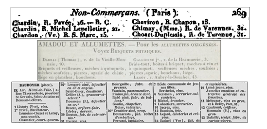
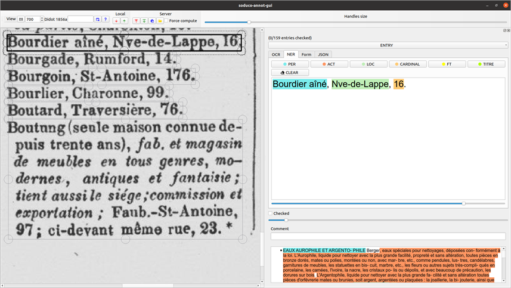
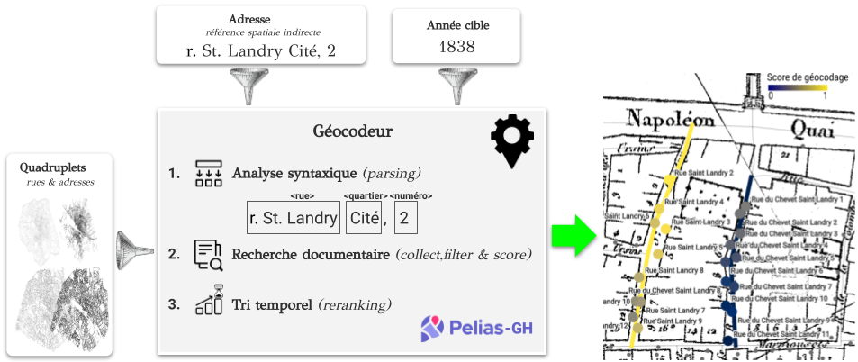
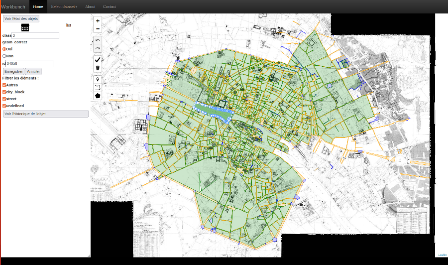
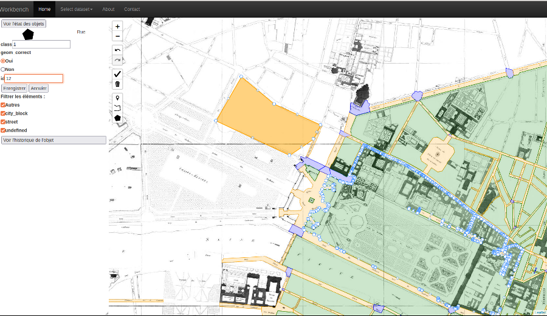
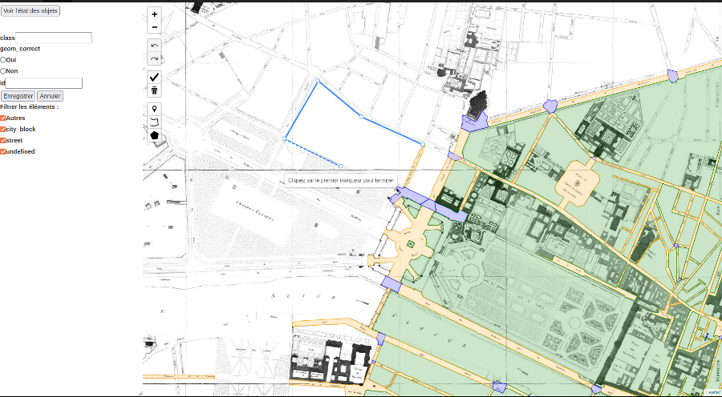
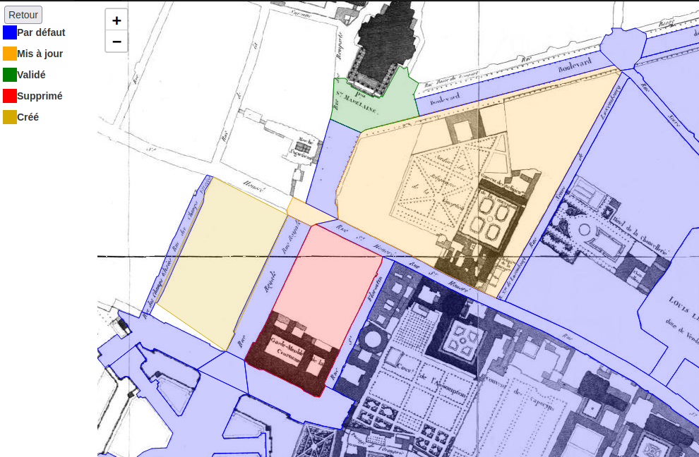
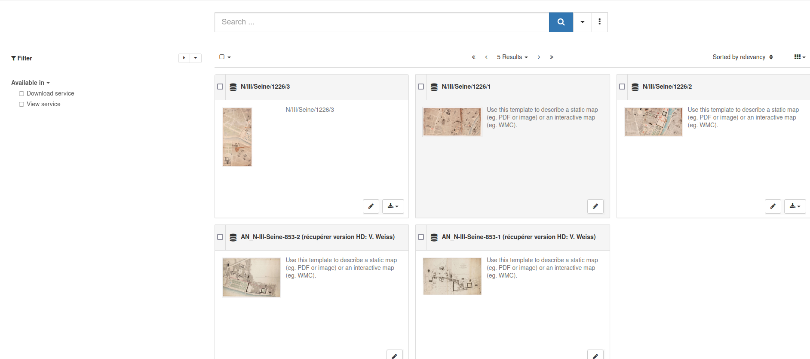

# Semi-automatic annotation tool

A semi-automatic text annotation tool is developped by the project. It takes PDF documents as input and processes them automatically by applying the three following steps:
- layout detection,
- optical characters recognition (with PERO OCR),
- named entities recognition (fine-tuned CamemBERT model).

Users can then check and manually correct each automatically detected and processed text section.

|  |
|:--:|
| <b>The trade directories from the 19th century are a challenging dataset with very heterogeneous layouts, fonts, and contents. Source: gallica.bnf.fr / Bibliothèque nationale de France</b>|

|  |
|:--:|
| <b>SODUCO text annotation tool</b>|

# Geohistorical geocoding tool

|  |
|:--:|
| <b>The historical geocoder takes both addresses and dates into account</b>|

# Old maps vectorisation tool

Add a description here.

|  |
|:--:|
| <b>Caption for the image</b>|

# Vector data validation and correction tool

A collaborative tool to validate and edit geospatial data and more is developped to improve data quality by getting a human validation of any type of geospatial data. It allows users to improve this quality by creating, removing, modifying or validating any feature (geometry and attributes).

|  |  |
|:--:|:--:|
| <b>General view of the tool with uploaded data</b>|<b>Edit mode, creation of the geometry of a new feature</b>|

|  |  |
|:--:| :--:|
| <b>Edit mode, change of attributes of an existing feature</b>|<b>Status mode to see what features were created, removed or modified</b>|

# Data and historical sources catalogue

A [catalog](https://soduco.github.io/catalog/) has been developped to store, reference and retrieve archival records and digital data used and produced throughout the project.

|  |
|:--:|
| <b>SODUCO catalog</b>|
