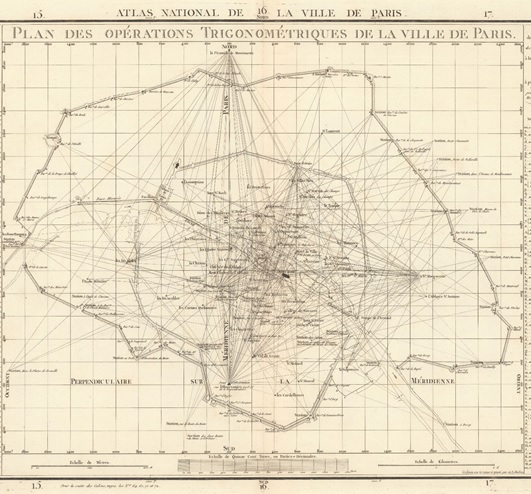

The Verniquet workshop brings together researchers from the SODUCO project and other partner institutions to work on the Verniquet Atlas. The aim is to critically analyse the Verniquet Atlas and especially its planimetric accuracy. We want to assess its potential for use as a historical cartographic reference resource.

|  |
|:--:|
| <b>Plan des opérations trigonométriques de la ville de Paris, sheet n°70 of the atlas, engraved and signed by A.J. Mathieu.</b>|

## Inventory of copies of the Verniquet atlas and other archival records pertaining to it

## Assessment of the planimetric accuracy of the Verniquet atlas

Verniquet's map was produced from 1780 to the end of the French Revolution. It has been designed and executed with a constant focus on geometric accuracy. Edme Verniquet's aim was to represent well measured and calculated geographical objects in order to produce an accurate view of the city from above. 

The survey work carried out by Edme Verniquet and the engineers working on this map was based on measurements that were claimed to be accurate to the nearest tenth of a *toise* - an old French unit of measure. Their measurements and calculations were eventually audited and validated by scientists at the Paris Observatory.

In line with this operation to check the quality of the map, the Verniquet workshop team is working to assess the planimetric accuracy of this historical cartographic source. The interest of this critical analysis work is twofold:
- to understand the processes used by Edme Verniquet and his engineers to draw up the map, to check the measurements and calculations made and, if necessary, to correct their errors,
- to assess whether this map has a planimetric accuracy that is good enough for it to serve as a primary source to create a geohistorical reference dataset on the city of Paris at the end of the 18th century.

## The Verniquet projected coordinate reference system

One of the results of the Verniquet workshop is the reconstitution of the parameters of the projected coordinate reference system defined and used by Edme Verniquet to draw up his map of Paris. This reference coordinate system was reused throughout the 19th century in many other maps of Paris. Knowing the parameters of this system allows it to be integrated into current Geographic Information System softwares and to process cartographic data natively defined in this coordinates reference system without having to transform them first into a modern reference coordinate system. 

